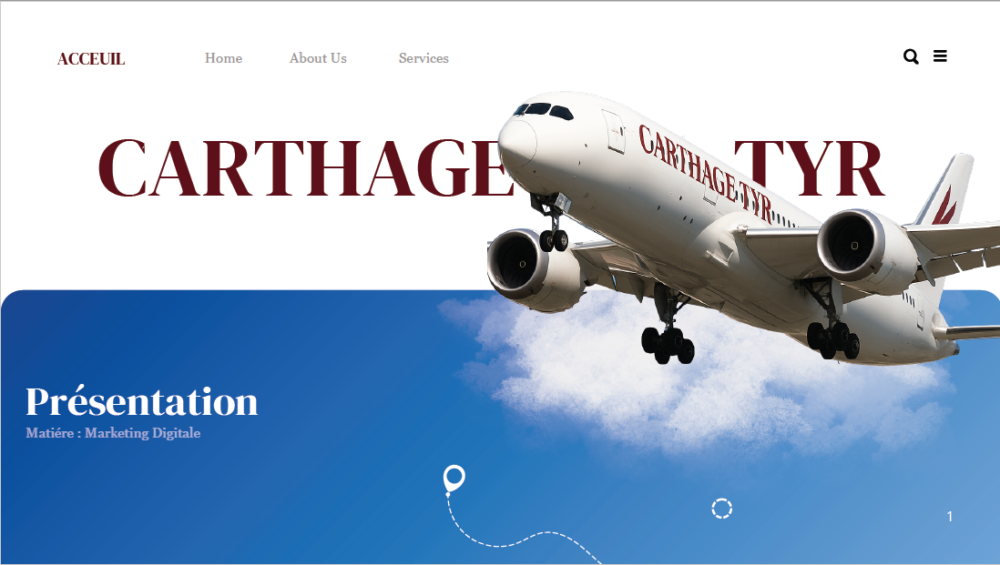
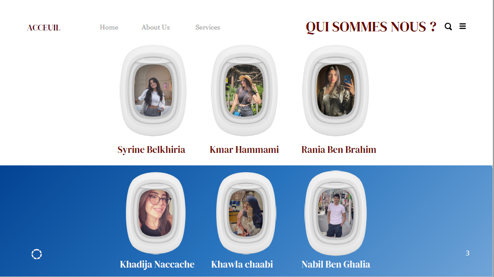
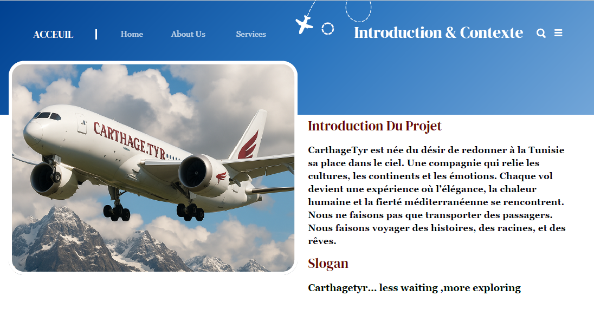
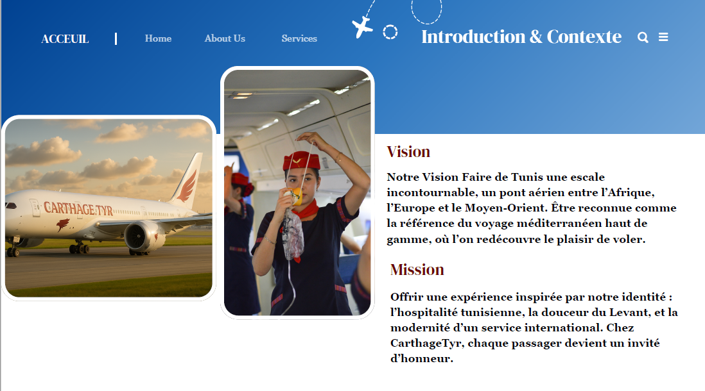
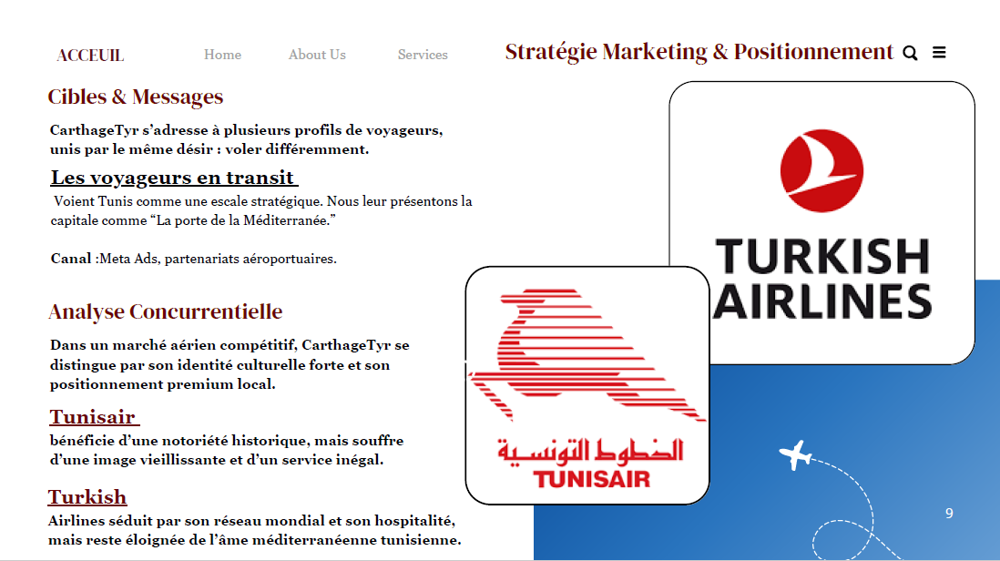
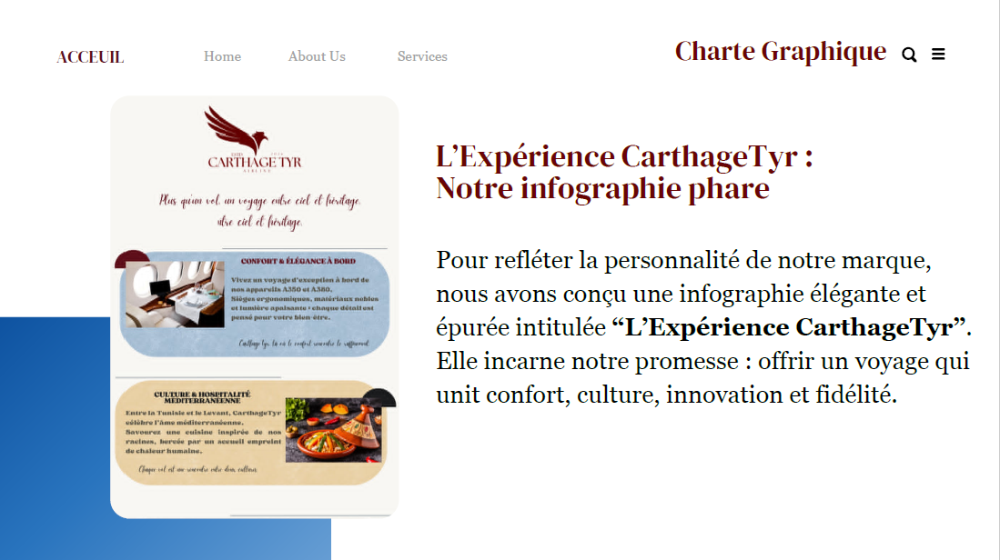
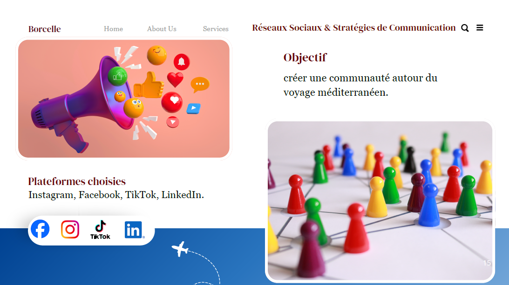
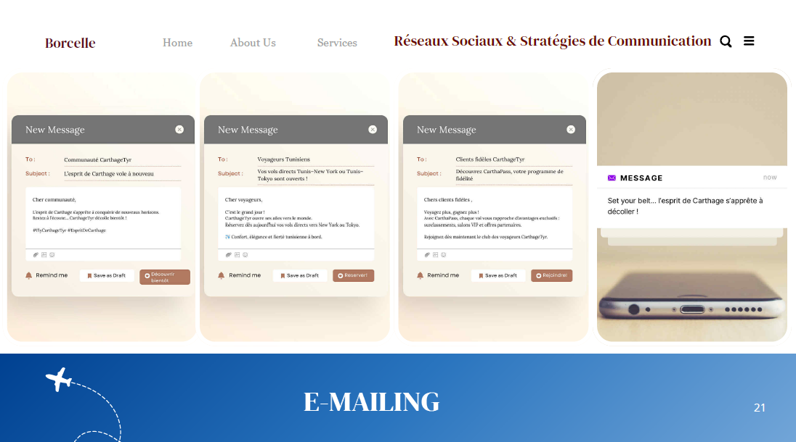
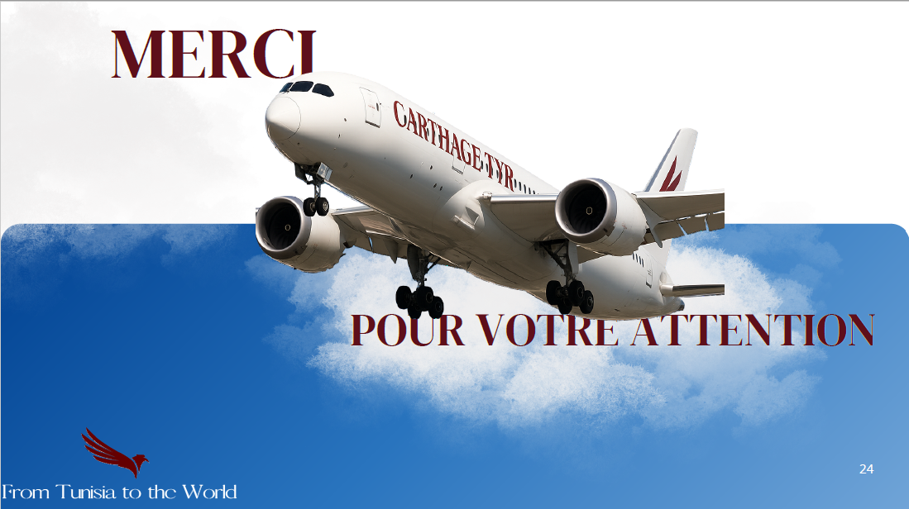

#  CarthageTyr – Projet Marketing Digital

##  Présentation du projet

**CarthageTyr** est un projet académique réalisé dans le cadre du module **Marketing Digital**.  
Il s’agit d’un projet de **branding, positionnement marketing et stratégie de communication** pour une compagnie aérienne fictive inspirée de l’identité tunisienne et méditerranéenne.

L’objectif est de concevoir une **marque aérienne premium**, moderne et émotionnelle, reliant la Tunisie au reste du monde à travers une expérience de voyage distinctive.

---

##  Équipe du projet

Le projet a été réalisé par une équipe pluridisciplinaire composée de :

- Syrine Belkhiria  
- Kmar Hammami  
- Rania Ben Brahim  
- Khadija Naccache  
- Khawla Chaabi  
- Nabil Ben Ghalia  

---

##  Introduction & Contexte

**CarthageTyr** est née du désir de redonner à la Tunisie sa place dans le ciel.  
Plus qu’une compagnie aérienne, la marque incarne un pont entre les cultures, les continents et les émotions.

Chaque vol est pensé comme une **expérience humaine**, où l’élégance, la chaleur méditerranéenne et la fierté culturelle se rencontrent.

**Slogan :**  
> *CarthageTyr… less waiting, more exploring*

---

##  Vision & Mission

###  Vision
Faire de Tunis une **escale incontournable**, un hub aérien entre l’Afrique, l’Europe et le Moyen-Orient, reconnu pour un voyage méditerranéen haut de gamme.

###  Mission
Offrir une expérience de vol inspirée par :
- l’hospitalité tunisienne  
- la douceur du Levant  
- la modernité d’un service international  

Chez **CarthageTyr**, chaque passager devient un invité d’honneur.

---

##  Stratégie Marketing & Positionnement

###  Cibles principales
- Voyageurs en transit
- Voyageurs tunisiens
- Clients premium sensibles à l’expérience culturelle

La Tunisie est positionnée comme **“La porte de la Méditerranée”**.

###  Canaux utilisés
- Meta Ads  
- Partenariats aéroportuaires  
- Réseaux sociaux  

---

##  Analyse Concurrentielle

Dans un marché aérien très concurrentiel, CarthageTyr se distingue par son **identité culturelle forte**.

###  Tunisair
- Forte notoriété historique  
- Image vieillissante  
- Expérience client inégale  

###  Turkish Airlines
- Réseau mondial solide  
- Excellente hospitalité  
- Identité éloignée de la culture tunisienne  

CarthageTyr se positionne comme une **alternative premium locale**, émotionnelle et moderne.

---

##  Charte Graphique & Identité Visuelle

L’identité visuelle de CarthageTyr repose sur :
- une palette élégante et épurée  
- des références culturelles méditerranéennes  
- une typographie premium  

L’infographie phare **“L’Expérience CarthageTyr”** reflète confort, innovation, culture et fidélité.

---

##  Réseaux Sociaux & Communication Digitale

###  Objectif
Créer une **communauté engagée** autour du voyage méditerranéen.

###  Plateformes utilisées
- Instagram  
- Facebook  
- TikTok  
- LinkedIn  

Chaque plateforme est exploitée selon une stratégie de contenu adaptée au public ciblé.

---

##  Stratégie E-mailing

La stratégie d’e-mailing vise à :
- fidéliser les clients  
- informer sur les nouveautés  
- renforcer le sentiment d’exclusivité  

Les messages sont personnalisés selon les profils :
- communauté CarthageTyr  
- voyageurs tunisiens  
- clients fidèles  

---

##  Conclusion

CarthageTyr est un projet complet de **marketing digital**, combinant :
- branding  
- stratégie marketing  
- communication digitale  
- identité visuelle  

Il démontre comment une compagnie aérienne peut se différencier non seulement par ses services, mais par une **expérience émotionnelle et culturelle forte**.

---

**From Tunisia to the World 🇹🇳✈️**
